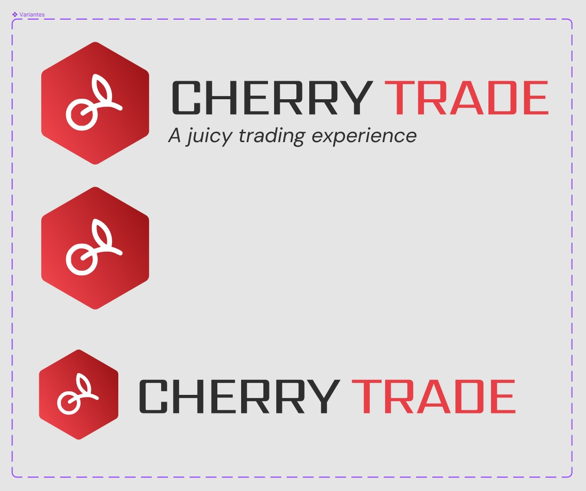
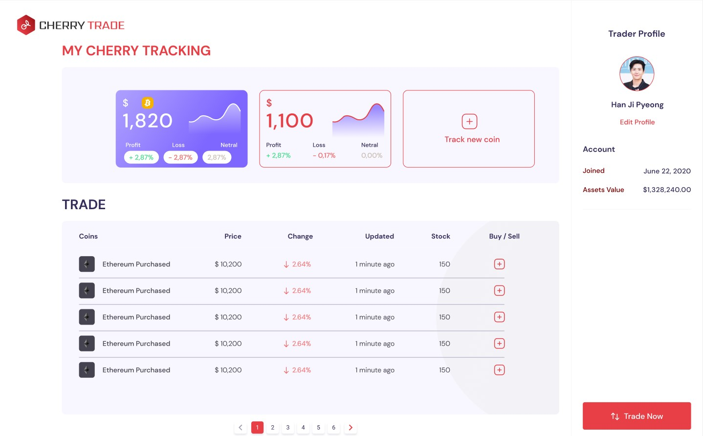
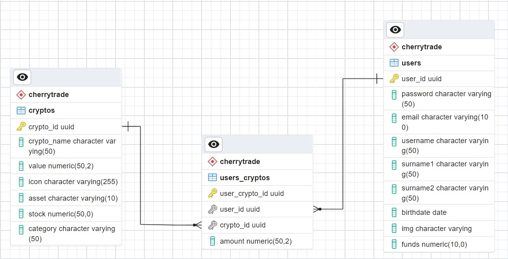
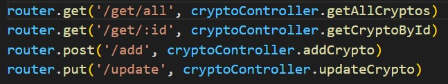
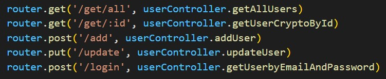
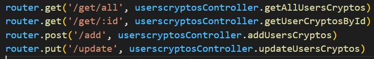

# CherryTrade

Proyecto creado por Jonathan Martín Rodríguez del 5 de Abril al 13 de Abril de 2023 para la hackathon propuesta por Santander.

## Creación de favicon, isotipo e imagotipos para el proyecto:

## Primer planteamiento del dashboard del proyecto:
​

​## Diseño del ERD para el proyecto:

​## Implantación de los distintos endpoints del proyecto:

​

